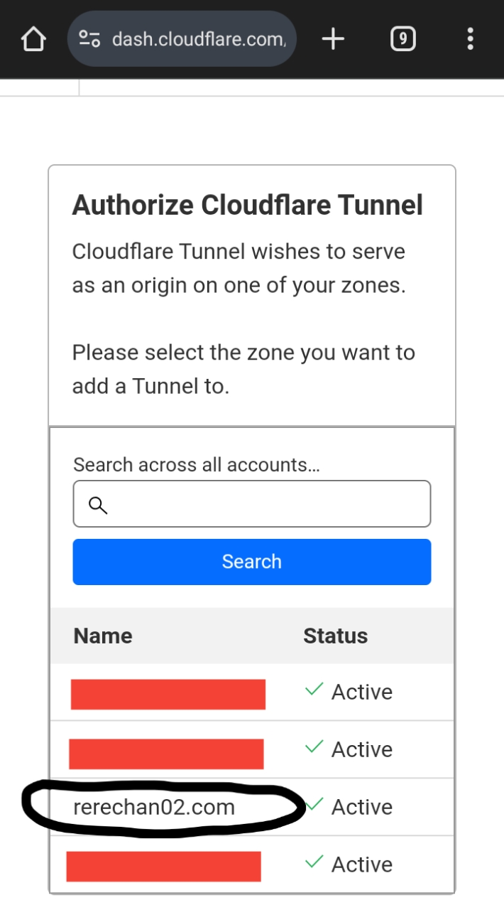
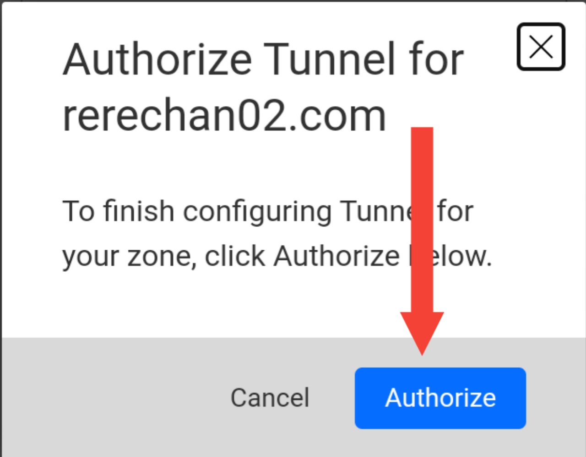
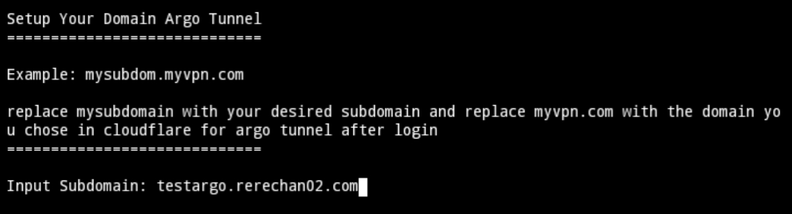

## Argo Tunnel By Rerechan02 Tutorial


## Install
```
Not Found
```

## CLI Menu Type
```shell
menu-argo
```

## Login To Cloudflared
- In the Argo menu, select the Install or Setup option.
- After that you get a link then copy and paste it in Chrome.
- Make sure that you have previously logged into your Cloudflare account.
- Select the domain you want to use as below, I use the domain rerechan02.com


## Auth
- After selecting a domain, click Authorized to verify.


## CLI
- Go back to your VPS CLI and enter the subdomain and the selected domain.
- Because previously I chose the domain rerechan02.com and I wanted to use the domain testargo.rerechan02.com, then I entered it, testargo as a subdomain and rerechan02.com is the domain that sellected


## Done
After everything is finished, the Argo tunnel service will automatically be activated and can be used.

Note:
- Customize the shell script to your server configuration.
- Please give credit if you modify the script :v

Donate:
- Dana: `083120684925`
- Paypal: `melon3344556@gmail.com`
- Qris All: [**Click To Get Qris**](https://t.me/fn_project/245)